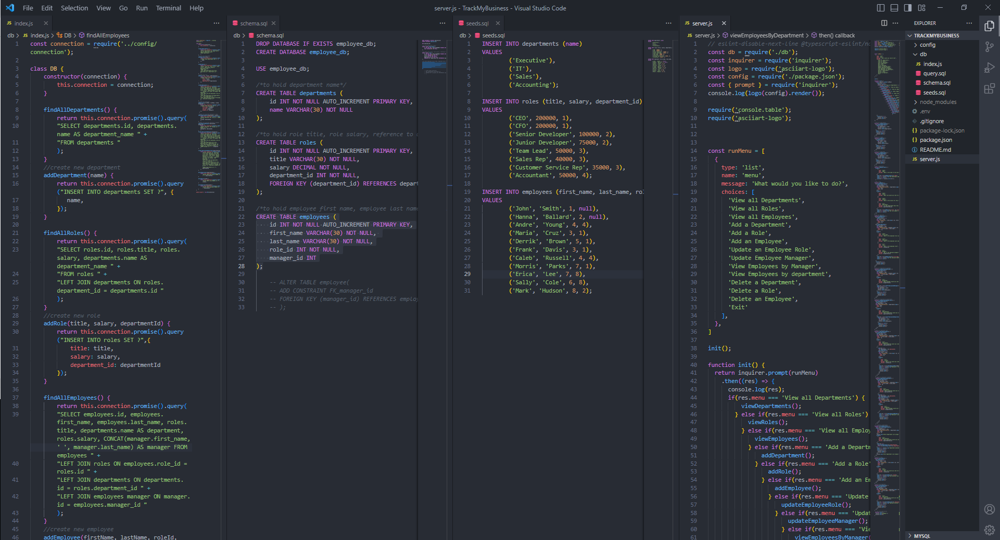

# TrackMyBusiness
  
 
  [Github repo](https://github.com/ampatte/TrackMyBusiness)

 

  ## Description
  SQL Challenge: Employee Tracker This project was an assignment to build a command-line application to manage a company's employee database.

  ## Table of Contents
  - [Installation Instructions](#Installation)
  - [Usage Information](#Usage)
  - [Contribution Guidelines](#Contribution)
  - [Test Instructions](#Test)
  - [Questions](#Questions)
  - [License](#License)
  
  ## Installation
  To run this project you would first have to run npm install with the following dependencies: Node.js, Inquirer, MySQL and console.table package.

  ## Usage
  The project was created as a homework assignment but it can be used in the real world to help organize a business.
  [Watch a walkthough of this application here.](https://watch.screencastify.com/v/GPVcaU1jGiwceCd3X5C5)

  
  ## Contribution
  I was the only contributer to this project.

  ## Test
  This project can be tested by following the prompts in the command line.

  ## Questions?
  - [Github link](https://github.com/ampatte)
  - [Email link](ampatte717@gmail.com)

  ## License
    This project is covered under the MIT license.(https://choosealicense.com/licenses/mit/)
